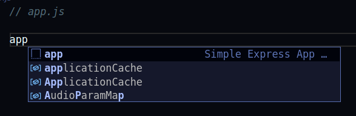

# Custom VS-Code Snippets

## What is a snippet?

Snippets are pretty much just small bits of code that is reusable.

## Why use custom snippets?

Snippets are very useful if you have a section of code that you need to write repetitively, which can get tedious after the 5000th time. You can use snippets as a shortcut for those sections of code.

VS Code does come with some sweet code snippet shortcuts such as '!' for HTML which generates basic HTML boilerplate to get you started quicker. There are also great extensions you can install that have some handy code snippets. But sometimes VS Code or the extension market won't have these handy shortcuts for specific bits of code you write. This is why you create your own.

## How to create your own snippets

For this example I am going to create a simple shortcut for a simple expressJS app. When I type `app` in a javascript file I want it to generate the following.

```javascript
const express = require("express");
const app = express();
const port = process.env.PORT || 5000;

app.get("/", (req, res) => {
  res.send("Hello World");
});

app.listen(port, () => {
  console.log(`Listening on https://localhost:${port}`);
});
```

1. In the top of VS Code, go to File > Preferences > User Snippets

2. You should be prompted with something like this
   

In this text box type in the language or file type you want to set this custom snippet for and open the file.

3. You should have a file open that has this inside

```json
{
  // Place your snippets for <YourFileType> here. Each snippet is defined under a snippet name and has a prefix, body and
  // description. The prefix is what is used to trigger the snippet and the body will be expanded and inserted. Possible variables are:
  // $1, $2 for tab stops, $0 for the final cursor position, and ${1:label}, ${2:another} for placeholders. Placeholders with the
  // same ids are connected.
  // Example:
  // "Print to console": {
  // 	"prefix": "log",
  // 	"body": [
  // 		"console.log('$1');",
  // 		"$2"
  // 	],
  // 	"description": "Log output to console"
  // }
}
```

4. You can go ahead and get rid of everything from this file. I will go through it from the start.

5. First of all create a pair of curly brackets `{}` everything will go inside of these brackets.

6. In a string, enter a name for your snippet, this is not too important what you call it, it is just a name for your snippet. I am going to call mine "Simple Express App".

```json
{
    "Simple Express App"
}

```

7. Then do a colon outside the double quotes and make another pair of curly brackets so it looks like this

```json
{
  "Simple Express App": {}
}
```

8. Create another string inside these brackets and type in `"prefix"`, the value you give this will be what you type in to VS Code for you to be able to generate the snippet. As I said earlier I wanted to type in `app` to be able to generate my snippet.

```json
{
  "Simple Express App": {
    "prefix": "app"
  }
}
```

9. Next add a string underneath (still in the "Simple Express App" brackets) that says "body" and give this an array as a value like this. This is where your actual snippet is going to be made. The reason this is an array is because each element in this array will be a string representing one line of your code snippet.

```json
{
  "Simple Express App": {
    "prefix": "app",
    "body": []
  }
}
```

10. Now let's create the actual code snippet. Something important to keep in mind is that JSON only accepts double quotes `""` so if you have any strings or need quote marks (like I do in my require method) you must use single quotes `''`

```json
{
  "Simple Express App": {
    "prefix": "app",
    "body": [
        "const express = require('express');",
        "const app = express();",
        "const port = process.env.PORT || 5000",
        "",
        "app.get('/', (req, res) => {",
        "res.send('Hello World')",
        "})",
        "",
        "app.listen(port, () => {",
        "console.log(`Listening on https://localhost:${port}`);"
        "})"
    ]
  }
}
```

11. You think you might be done, but there are a few more things I want to add to make my life even easier. Currently it will work, if I go into a javascript file and type `app` it will come up on the little list and allow me to generate it, but there is no indentation. Now to add in tabs for indentation you can use `\t` to add a tab. I will update mine below with tabs.

```json
{
  "Simple Express App": {
    "prefix": "app",
    "body": [
        "const express = require('express');",
        "const app = express();",
        "const port = process.env.PORT || 5000",
        "",
        "app.get('/', (req, res) => {",
        "\tres.send('Hello World')",
        "})",
        "",
        "app.listen(port, () => {",
        "\tconsole.log(`Listening on https://localhost:${port}`);"
        "})"
    ]
  }
}
```

12. There is just ONE more thing I want to add. Let's say for my `port` variable, I don't want to use `5000`, I want to use `1234` or `3001`, or I don't want the message to be `"Hello World"`. Well I can use placeholders!. When I generate the snippet I can make it so it moves my cursor to a specific point in my snippet and allow me to change the value easily. The syntax for a placeholder is `${1:label}` The number is used to choose the order of the locations your cursor moves to when you hit TAB, the first stop is number 1, the second is 2 and so on. The word `label` in that is just the placeholder text you want to use. If you don't want any placeholder text and just want to move your cursor to a certain point. you can just use `$1`, the number here is the same. This is my final code snippet.

```json
{
  "Simple Express App": {
    "prefix": "app",
    "body": [
        "const express = require('express');",
        "const app = express();",
        "const port = process.env.PORT || ${1:5000}",
        "",
        "app.get('/', (req, res) => {",
        "\tres.send('${2:Hello World}')",
        "})",
        "",
        "app.listen(port, () => {",
        "\tconsole.log(`Listening on https://localhost:${port}`);"
        "})"
    ]
  }
}
```

You are completely finished, this next part is completely optional, but if you really want, you can add a description for your snippet. I won't for mine, but here is how you do it anyways.

```json
{
  "Simple Express App": {
    "prefix": "app",
    "body": [
        "const express = require('express');",
        "const app = express();",
        "const port = process.env.PORT || ${1:5000};",
        "",
        "app.get('/', (req, res) => {",
        "\tres.send('${2:Hello World}');",
        "});",
        "",
        "app.listen(port, () => {",
        "\tconsole.log(`Listening on https://localhost:${port}`);"
        "});"
    ],
    "description":"this is a very interesting description"
  }
}
```

## How do you use your new snippet?

In a new or existing file (make sure it is the same file type as the file type you made a snippet for) and begin typing the prefix you chose. Mine was `app`. You should be box like this come up.

If this does not come up for you begin typing (or type the full prefix) then press `Ctrl + Space` or `⌘ + Space` it will bring up that box with snippets. When the prefix is at the top of that little box (or you select it with arrow keys) hit `Enter` and **boom!** Watch your snippet appear.
